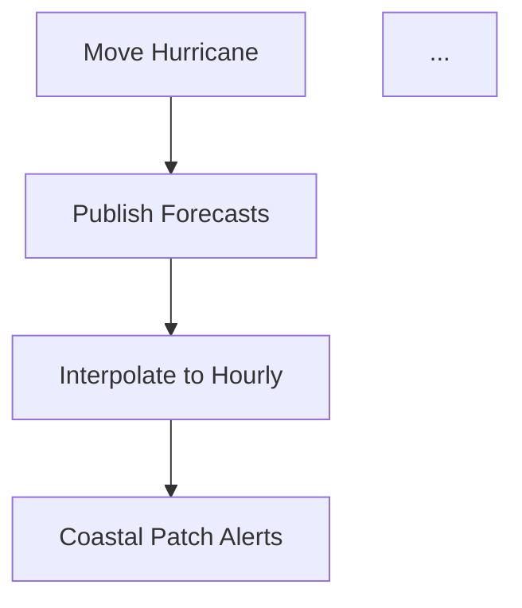

# odder Improvement Plan: Publication-Quality ODD Generation

> Generated: 2026-03-27
> Based on: Scientist feedback comparing odder-generated ODD vs. human-written ODD (CHIME ABM)
> Research: 3 oracle agents surveyed citation tools, diagram tools, and equation rendering
> Goal: Indistinguishable from human-written ODDs, configurable Markdown/LaTeX output, multi-agent compatible

## Executive Summary

Five gaps separate odder-generated ODDs from human-written ones. In order of impact:

1. **Citations/Bibliography** — References papers by name but no formal bibliography with full entries
2. **Diagrams** — Zero figures vs. human ODD's 4 (interface screenshot, conceptual model, network viz, risk function curve)
3. **Numbered Equations** — Equations ARE extracted (LaTeX `$$...$$`), but not numbered or cross-referenced
4. **Technical Context** — Missing programming language, platform version, code repository links
5. **Narrative Voice** — Clinical reference document vs. explanatory narrative with design rationale

Additionally, the dual-format output (Markdown + LaTeX/PDF) requires a **Pandoc-based compilation pipeline**.

---

## Architecture: The Pandoc Pipeline

All improvements converge on **Pandoc** as the compilation backbone. The ODD stays in Markdown as the source of truth, enriched with:

- `[@key]` citation keys → resolved via `--citeproc` against a `.bib` file
- ` ```mermaid` / ` ```dot` code blocks → rendered via `pandoc-ext/diagram` Lua filter
- `$$...$$` equations → native in both Markdown and LaTeX
- YAML frontmatter → controls bibliography, CSL style, output format

```
odder/draft/odd.md (Pandoc-flavored Markdown)
    + odder/draft/references.bib
    + odder/draft/diagrams/ (auto-generated .mmd/.dot files)
    │
    ├─→ pandoc --citeproc -L diagram.lua → odd.pdf (publication-ready)
    ├─→ pandoc --citeproc -L diagram.lua -t latex → odd.tex
    └─→ Raw Markdown (GitHub-renderable with Mermaid + $...$ math)
```

### New skill: `/odd-compile` (optional post-processing)

A lightweight skill that runs the Pandoc pipeline. Not required — the Markdown output is self-contained and renderable on GitHub. But for publication, users run `/odd-compile` to get PDF/LaTeX with rendered diagrams, formatted bibliography, and numbered equations.

**Prerequisites:** `pandoc`, `pandoc-ext/diagram` Lua filter, optionally `mmdc` (Mermaid CLI) and `dot` (Graphviz).

---

## Change Plan by Dimension

### 1. Citations/Bibliography

**Problem:** odder ODD references papers like "Grimm et al. (2020)" in text but produces no formal References section with full bibliographic entries (journal, volume, pages, DOI).

**Root cause:** No citation infrastructure exists. The draft skill says "cite sources" but only means code-line references, not academic citations.

#### Changes

**A. New reference file: `references/odd-core.bib`** (shared across skills)

Create a BibTeX file with the core ODD papers that every generated ODD cites:

- Grimm et al. 2006 (original ODD)
- Grimm et al. 2010 (first update)
- Grimm et al. 2020 (ODD+2 — second update)
- Railsback & Grimm 2019 (textbook)
- Muller et al. 2013 (if needed)

This file ships with the skill pack. Model-specific papers are added during draft generation.

**B. Update `/odd-interview` SKILL.md**

Add to the interview Question Bank:

- **New question (Element 1 — Purpose):** "What papers or publications should be cited in the ODD? Please provide DOIs, full references, or paper titles for any foundational work this model builds on."
- **New question (Element 4.1 — Basic Principles):** "What theoretical frameworks or published models does this model draw from? I'll need proper citations for these."
- **New question (Element 7 — Submodels):** "Do any submodels implement algorithms from specific papers? If so, which papers?"

Add to findings.md output template:

```markdown
## Citations Collected

| Paper | DOI | Context |
| ----- | --- | ------- |
```

**C. Update `/odd-plan` SKILL.md**

Add a Citations section to the plan template:

```markdown
## Citation Requirements

### Core ODD citations (auto-included)

- [@grimm2006] — ODD protocol
- [@grimm2020] — ODD+2 update

### Model-specific citations (from interview)

[list papers collected during interview with DOIs where available]

### Citation resolution instructions

For any paper referenced by name without a DOI:

1. Search CrossRef API: https://api.crossref.org/works?query={title}
2. Or use Citation.js CLI: citation-js --input "{DOI}" -t string -s bibtex
3. Add the BibTeX entry to odder/draft/references.bib
```

**D. Update `/odd-draft` SKILL.md**

Replace the current References section instructions with:

````markdown
### Citation Format

Use Pandoc-style citation keys throughout the document:

- Parenthetical: [@grimm2020]
- Narrative: @grimm2020
- Multiple: [@grimm2006; @grimm2020]
- With page: [@grimm2020, p. 42]

### Bibliography File

Create `odder/draft/references.bib` containing BibTeX entries for all cited works.
Start with the core entries from `references/odd-core.bib` (bundled with this skill).
Add model-specific entries from the plan's Citation Requirements section.

For papers where only a title is known, attempt to resolve the DOI via:

- CrossRef API: curl -s "https://api.crossref.org/works?query={url-encoded-title}&rows=1"
- Extract the DOI from the response and fetch BibTeX:
  curl -LH "Accept: application/x-bibtex" "https://doi.org/{DOI}"

### YAML Frontmatter

Include in the ODD document header:

```yaml
---
bibliography: references.bib
csl: apa-7th-edition.csl
---
```
````

### References Section

End the document with:

```markdown
## References

::: {#refs}
:::
```

Pandoc will auto-populate this. For pure Markdown viewing (without Pandoc),
also write out the references manually in APA format as a fallback.

````

**E. Update `/odd-check` SKILL.md**

Add to verification Check B (Source Traceability):
- [ ] All academic papers referenced in the ODD have entries in references.bib
- [ ] Citation keys in the text match entries in the .bib file
- [ ] References section is present and contains all cited works

**Tools involved:** CrossRef API (free, no auth), Citation.js CLI (npm), Pandoc + citeproc (for compilation). Optionally: Academix MCP server for AI-driven literature search.

---

### 2. Diagrams

**Problem:** Human ODDs contain figures (model interface, conceptual diagrams, network visualizations, function plots). odder generates zero.

**Root cause:** No diagram generation instructions exist in any skill.

#### Changes

**A. Update `/odd-interview` SKILL.md**


Add to Phase 2 (File Inventory):
```markdown
4. Look for existing figures, diagrams, or visualizations:
   - Screenshots of model interface/GUI
   - Published figures from papers about this model
   - Diagrams in documentation (flowcharts, architecture diagrams)
   - Network or spatial visualizations


   Ask the modeler: "Do you have any existing figures or diagrams that
   should be included in the ODD? (model interface screenshots, published
   figures, conceptual diagrams)"
````

Add to findings.md output:

```markdown
## Diagrams Inventory

| Diagram | Source | Type | Auto-generatable? |
| ------- | ------ | ---- | ----------------- |
```

**B. Update `/odd-plan` SKILL.md**

Add a Diagrams section to the plan:

```markdown
## Diagram Plan

For each ODD section, specify which diagrams to generate:

### Required diagrams (auto-generate from code analysis):

1. **Process scheduling flowchart** (Element 3) — Mermaid flowchart from the Go/step procedure
2. **Entity hierarchy** (Element 2) — Mermaid class diagram showing entity types and state variables
3. **Information/interaction flow** (Element 4.8) — Mermaid flowchart or sequence diagram

### Required diagrams (from existing materials):

4. **Model interface screenshot** (Element 2/8) — Include if provided by modeler
5. **Spatial environment** — Include if GIS/spatial data is documented

### Optional diagrams (generate if submodel complexity warrants):

6. **Submodel flowcharts** (Element 7) — For complex submodels only
7. **Network structure** (Element 4.10) — Graphviz DOT if model has social/spatial networks
8. **Key function plots** (Element 7) — For critical mathematical functions (e.g., risk curves)

### Diagram specifications

For each auto-generated diagram, include:

- Diagram type (Mermaid flowchart / Mermaid ER / Graphviz DOT / placeholder)
- What entities/processes to include
- Expected level of detail
- Caption text
```

**C. Update `/odd-draft` SKILL.md**

Add diagram generation instructions:

````markdown
## Diagram Generation

Generate diagrams using text-based diagram languages embedded in Markdown code blocks.
These render natively on GitHub and compile to images via pandoc-ext/diagram for PDF output.

### Process Scheduling (Element 3)

Generate a Mermaid flowchart showing the per-tick execution order:


````

### Entity Hierarchy (Element 2)

Generate a Mermaid class diagram showing entity types:

```mermaid
classDiagram
    class CitizenAgent {
        +risk-life-threshold: float
        +interpreted-forecast: list

        +evacuated: boolean
        ...
    }
    ...
```

### Network Structure (if applicable)

Use Graphviz DOT for network topology:

```dot
graph G {
    layout=neato
    node [shape=point]
    ...
}
```

### Placeholder Pattern

For diagrams that cannot be auto-generated, include a specification block:

> **[FIGURE: Model Interface Screenshot]**
> Caption: CHIME ABM interface showing user-adjustable parameters (left)
> and modeled world with hurricane approaching Florida (right).
> Source: [provide screenshot or describe how to capture]
> Dimensions: full-width

### Diagram Rules

1. One diagram per concept — keep diagrams focused and small
2. Always include a caption with figure number: "Figure 1. ..."
3. Number figures sequentially throughout the document
4. Cross-reference figures in text: "as shown in Figure 1"
5. For Mermaid: keep under 15 nodes per diagram to avoid layout chaos
6. For network diagrams with 50+ nodes: use Graphviz DOT, not Mermaid
7. Save diagram source files to odder/draft/diagrams/ for reuse

````

**D. Update `/odd-check` SKILL.md**

Add to structural completeness:
- [ ] At least one diagram is present (process flowchart at minimum)
- [ ] All figures have captions and sequential numbering
- [ ] Figures are cross-referenced in the text
- [ ] Diagram code blocks use correct syntax (Mermaid/DOT/PlantUML)

**Tools involved:** Mermaid (npm: @mermaid-js/mermaid-cli), Graphviz (apt: graphviz), pandoc-ext/diagram Lua filter, Kroki API as fallback renderer. Optionally: hustcc/mcp-mermaid for validation.


**Reference:** Visual ODD (vODD) templates from JASSS 2024 for layout inspiration.

---

### 3. Numbered Equations

**Problem:** Equations exist in LaTeX notation but are not numbered or cross-referenced like in human ODDs (eq. 1, eq. 2, etc.).

**Root cause:** Draft skill says "use LaTeX notation" but doesn't instruct numbering or cross-referencing.

#### Changes

**A. Update `/odd-interview` SKILL.md**

Strengthen equation extraction in the Question Bank, Element 7 (Submodels):
```markdown
For each process identified in Element 3, ask:
- What is the exact mathematical formulation? (equations, not prose descriptions)
- Can you write out the equation with variable definitions?
- What are the units of each variable in the equation?
- Are there any conditional expressions or piecewise functions?

**Important:** When you find mathematical operations in the code, convert them
to standard mathematical notation and present them to the modeler for verification.
Do not describe equations in prose when a formula exists.
````

**B. Update `/odd-draft` SKILL.md**

Replace the equation instructions:

```markdown
### Equation Format

Number all equations sequentially throughout the document.
Use Pandoc-compatible numbering:

For display equations with numbers:

$$dist\_trk = \frac{scale \cdot dtrack}{2} \cdot \frac{0.0011}{errbars} + 0.0011 \tag{1}$$

Cross-reference in text as "equation (1)" or "eq. (1)".

For inline math: $\mathcal{N}(\mu=14, \sigma=2)$

### Equation Rules

1. Every submodel with mathematical logic MUST have at least one numbered equation
2. Define all variables immediately after the equation
3. State units for every variable

4. Use consistent notation throughout (same symbol = same variable everywhere)
5. Number equations sequentially: (1), (2), (3), ...
6. Cross-reference equations in prose: "as defined in equation (3)"
7. For piecewise functions, use cases notation:
   $$f(x) = \begin{cases} a & \text{if } x > 0 \\ b & \text{otherwise} \end{cases} \tag{2}$$
```

**Tools involved:** None — this is purely a prompting improvement. LaTeX `\tag{N}` works in both Markdown math renderers and LaTeX output.

---

### 4. Technical Context / Implementation Section

**Problem:** No mention of programming language, platform version, or code repository.

**Root cause:** ODD+2 protocol's "Linking ODD to Code" guidance exists in the reference but isn't reflected in the interview questions or draft template.

#### Changes

**A. Update `/odd-interview` SKILL.md**

Add a new question set after Phase 2 (File Inventory):

```markdown
#### Implementation Context

- What programming language/platform is the model implemented in? What version?
- What libraries, extensions, or frameworks does it depend on?
- Where is the source code available? (GitHub URL, COMSES, institutional repository)
- Is the code documented/commented?
- Are there hardware requirements or performance considerations?
- What operating system(s) has the model been tested on?
```

Add to findings.md:

```markdown
## Implementation Context

- Language/Platform: [e.g., NetLogo 6.1]
- Key extensions: [e.g., GIS extension, NW extension]
- Repository: [URL]
- Documentation: [level of code commenting]
- Hardware: [any special requirements]
```

**B. Update `/odd-draft` SKILL.md**

Add an Implementation section to the ODD template, between the header and Element 1:

```markdown
## Implementation

[Model name] is implemented in [language] [version]. [Brief description
of the platform and why it was chosen.] The model relies on [key
extensions/libraries].

The source code is available at [repository URL] and [additional archives
like COMSES]. The code is [level of documentation — e.g., "thoroughly
commented as a companion to this description"].

| Component | Technology            | Version            |
| --------- | --------------------- | ------------------ |
| Platform  | [e.g., NetLogo]       | [e.g., 6.1]        |
| Extension | [e.g., GIS extension] | [version if known] |
| ...       | ...                   | ...                |

[source: ...] {confidence}
```

**Tools involved:** None — skill prompt changes only.

---

### 5. Narrative Voice & Design Rationale

**Problem:** Generated ODD reads as a clinical reference document ("The model does X") rather than an explanatory narrative ("We designed X because...").

**Root cause:** Draft skill focuses on precision and traceability, which produces accurate but dry prose. The interview skill doesn't probe deeply enough for "why" explanations.

#### Changes

**A. Update `/odd-draft` SKILL.md**

Add to Writing Standards:

```markdown
### Voice and Narrative

Write in a style that balances precision with explanation:

- Use active voice where appropriate: "We designed the citizen-agent decision
  model based on the PADM framework" rather than "The citizen-agent decision
  model is based on the PADM framework"
- For each major design decision, include WHY it was made — not just WHAT it does
- Connect design decisions to the research context: what problem was being solved,
  what alternatives were considered, what literature informed the choice
- Use the modeler's own framing from the interview when explaining rationale
- Narrative sections can use first person ("we") when describing design choices;
  descriptive sections use third person ("the model")

### Rationale Subsections

For Elements 2, 3, and 7, include a Rationale subsection when the research
findings contain design rationale. Structure as:

- What decision was made
- What alternatives existed
- Why this approach was chosen (cite literature or modeler explanation)
- What limitations the modeler acknowledges
```

**B. Update `/odd-interview` SKILL.md**

Add to the interview protocol:

```markdown
**Rationale probing:** After documenting what the model does for each element,
ask ONE follow-up about why:

- "Why did you choose [this approach] over alternatives?"
- "What informed this design decision — was it based on literature, empirical
  data, or practical constraints?"

- "Are there known limitations of this approach that you'd want documented?"

Do not ask rationale questions for every minor detail — focus on:

- Choice of entity types (Element 2)
- Process scheduling order (Element 3)
- Key submodel formulations (Element 7)
- Network/interaction structure (Element 4.8)
```

**Tools involved:** None — prompting improvements only.

---

### 6. Input File Inventory Table

**Problem:** Human ODD has Tables 1a/1b listing every input file with type and purpose. Generated ODD describes input data in prose.

#### Changes

**Update `/odd-draft` SKILL.md** — Add to Element 6 (Input Data) template:

```markdown
### Input File Inventory

Create a table listing all input files the model requires:

| File       | Type                     | Format           | Description        |
| ---------- | ------------------------ | ---------------- | ------------------ |
| [filename] | [GIS/text/CSV/shapefile] | [format details] | [what it contains] |

Group files by category (map data, storm data, census data, etc.).
For each file, note whether it is required for all runs or scenario-specific.
```

---

### 7. Broader Research Context

**Problem:** Human ODD discusses the larger research project, team composition, and how the model fits within a multi-method program. Generated ODD lacks this.

#### Changes

**Update `/odd-interview` SKILL.md** — Add to Element 1 questions:

```markdown
- Is this model part of a larger research project? If so, how does it fit in?
- Who was involved in the model's development? (disciplines, team composition)
- Has this model been published or presented? If so, where?
```

---

## Implementation Roadmap

### Phase 1: Skill Prompt Improvements (no tooling dependencies)

These changes are purely edits to SKILL.md files:

| Change                                | Skill                    | Complexity | Impact |
| ------------------------------------- | ------------------------ | ---------- | ------ |
| Numbered equations + cross-references | odd-draft                | Low        | Medium |
| Implementation section template       | odd-interview, odd-draft | Low        | Medium |
| Input file inventory table            | odd-draft                | Low        | Low    |
| Narrative voice instructions          | odd-draft                | Low        | Medium |
| Rationale probing questions           | odd-interview            | Low        | Medium |
| Broader research context questions    | odd-interview            | Low        | Low    |
| Equation extraction strengthening     | odd-interview            | Low        | Medium |
| Diagram inventory in interview        | odd-interview            | Low        | Medium |
| Citation collection in interview      | odd-interview            | Low        | High   |

### Phase 2: Diagram Generation (requires Mermaid familiarity)

| Change                          | Skill                | Complexity | Impact |
| ------------------------------- | -------------------- | ---------- | ------ |
| Diagram plan section            | odd-plan             | Medium     | High   |
| Diagram generation instructions | odd-draft            | Medium     | High   |
| Diagram verification checklist  | odd-check            | Low        | Medium |
| Process flowchart template      | odd-draft references | Medium     | High   |
| Entity diagram template         | odd-draft references | Medium     | Medium |

### Phase 3: Citation Pipeline (requires new files + tooling docs)

| Change                           | Skill                  | Complexity | Impact |
| -------------------------------- | ---------------------- | ---------- | ------ |
| Create odd-core.bib              | references/ (new file) | Low        | High   |
| Pandoc citation key format       | odd-draft              | Medium     | High   |
| Citation resolution instructions | odd-plan, odd-draft    | Medium     | High   |
| Bibliography verification        | odd-check              | Low        | Medium |
| YAML frontmatter template        | odd-draft              | Low        | Medium |

### Phase 4: Compilation Pipeline (new skill)

| Change | Skill | Complexity | Impact |
| ------ | ----- | ---------- | ------ |

| `/odd-compile` skill | new skill | High | High |
| pandoc-ext/diagram integration | odd-compile | Medium | High |
| PDF/LaTeX output | odd-compile | Medium | High |
| CSL style selection | odd-compile | Low | Low |

### Phase 5: Feedback Loop Updates

| Change                         | Skill                                | Complexity | Impact |
| ------------------------------ | ------------------------------------ | ---------- | ------ |
| Add diagram quality questions  | odd-feedback                         | Low        | Medium |
| Add citation quality questions | odd-feedback                         | Low        | Medium |
| Add equation quality questions | odd-feedback                         | Low        | Low    |
| Update tag vocabularies        | odd-feedback, odd-integrate-feedback | Low        | Low    |

---

## Tool Dependencies

### Required (for full pipeline)

| Tool               | Install                                       | Purpose                  | Used by      |
| ------------------ | --------------------------------------------- | ------------------------ | ------------ |
| Pandoc             | `apt install pandoc` or `brew install pandoc` | Document compilation     | /odd-compile |
| pandoc-ext/diagram | Lua filter download                           | Diagram rendering in PDF | /odd-compile |

### Recommended

| Tool            | Install                            | Purpose                        | Used by                  |
| --------------- | ---------------------------------- | ------------------------------ | ------------------------ |
| Citation.js CLI | `npm i -g citation-js`             | DOI → formatted citation       | /odd-draft               |
| Mermaid CLI     | `npm i -g @mermaid-js/mermaid-cli` | Diagram validation + rendering | /odd-draft, /odd-compile |
| Graphviz        | `apt install graphviz`             | Network topology diagrams      | /odd-draft               |

### Optional (MCP servers for enhanced AI workflows)

| Tool               | Purpose                                        | Best for                   |
| ------------------ | ---------------------------------------------- | -------------------------- |
| Academix MCP       | Multi-source literature search + BibTeX export | Finding citations by title |
| hustcc/mcp-mermaid | Mermaid validation + rendering                 | Diagram quality assurance  |

---

## Research Reports

Full research details are saved at:

- `.claude/cache/agents/oracle/output-2026-03-27-citation-tools-research.md`
- `.claude/cache/agents/oracle/output-2026-03-27-diagram-generation.md`

Key external references:

- [Visual ODD (JASSS 2024)](https://www.jasss.org/27/4/1.html) — Standardized ABM visualization template
- [pandoc-ext/diagram](https://github.com/pandoc-ext/diagram) — Unified diagram rendering Lua filter
- [CrossRef API](https://www.crossref.org/documentation/retrieve-metadata/rest-api/) — Free DOI metadata resolution
- [Citation.js](https://citation.js.org/) — DOI → formatted citation CLI
- [Academix MCP](https://github.com/xingyulu23/Academix) — Multi-source academic search MCP server

---

## What NOT to Change

Based on the comparison, these aspects of odder are already strong and should be preserved:

- **Confidence annotations** ({CODE_VERIFIED}, {INFERRED}, etc.) — unique strength, not in human ODDs
- **Inline source references** ([source: file:line]) — valuable for traceability
- **Knowledge gap documentation** — honest about what's unknown
- **Exhaustive state variable tables** — more systematic than human ODDs
- **Traceability matrix** — companion artifact with no human equivalent
- **Adaptive interview strategy** — input-quality-based approach works well
- **Autonomy level propagation** — respects user preference across phases
